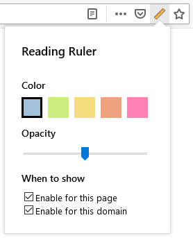

# Reading Ruler
[](https://addons.mozilla.org/en-US/firefox/addon/readingruler/)

Reading Ruler is a browser add-on that highlights the row of text under the mouse cursor. This helps you focus on the text you are currently reading, or come back to it if your mind wanders as you read.

The ruler works best for articles, blogs and long posts. You can hide it on pages or sites where it doesn't help as much.

You can choose the color and opacity of the ruler for the level of contrast you like best.

Reading Ruler does not collect your data. It does not send anything to the cloud. It does not collect telemetry. It is not interested in monetization; and, it definitely does not show ads.




# Notes to developers
## Running the add-on locally
Before running the add-on on your development computer for the first time:
```
yarn
yarn polyfills
```

To run the add-on in a sandboxed instance of Firefox, run:
```
yarn start
```

## Publishing to the Mozilla Developer Hub
Before publishing:
1. Bump the version number in `package.json` and `manifest.json`.
2. Build and pack the add-on:
    ```
    yarn build
    ```