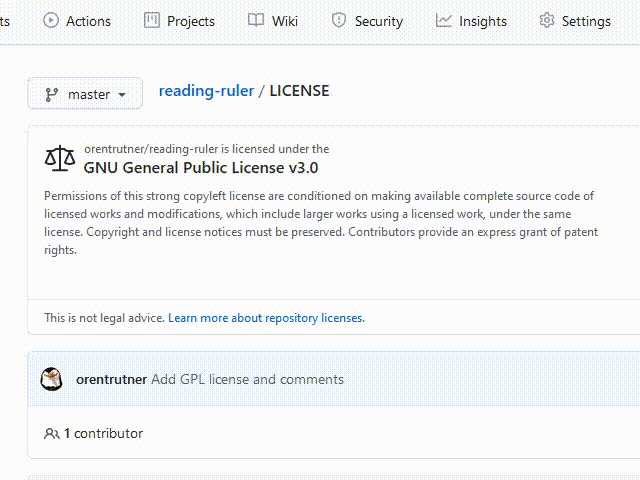

# Reading Ruler
Reading Ruler highlights the row of text under the mouse cursor. This helps you focus on the text you are currently reading, or come back to it if your mind wanders a bit as you read.

The ruler works best for articles, blogs and long posts. You can disable it on pages or sites where it doesn't help as much.



# Building
Before running locally:
```
yarn
yarn polyfills
```

Before publishing:
```
yarn build
```